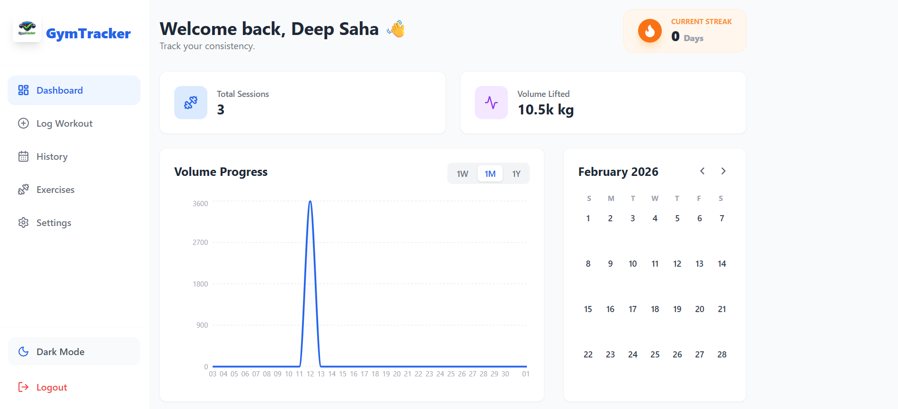
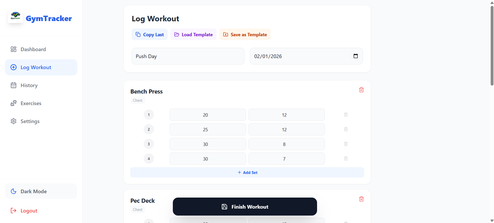
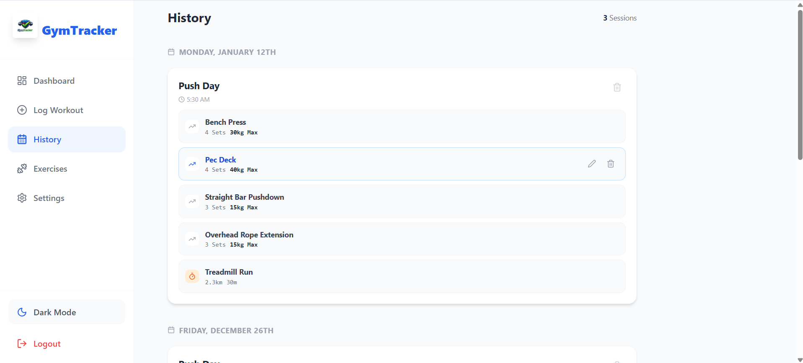
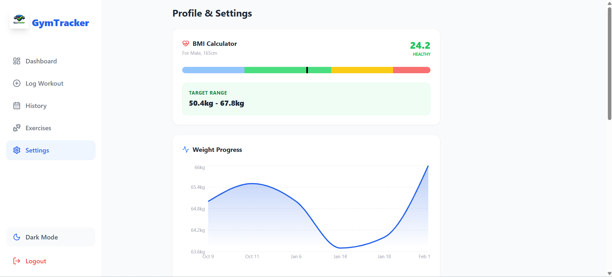
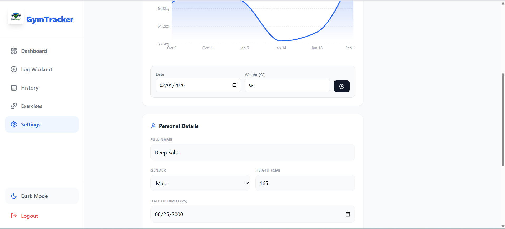
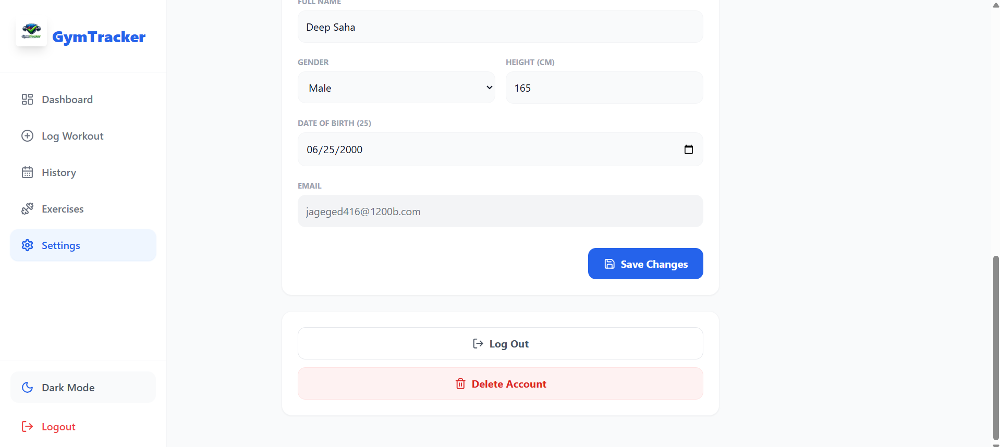

# 🏋️‍♂️ Gym Tracker

Gym Tracker is a full‑stack fitness application to log workouts, track progress, and analyze performance over time. It features a modern responsive UI, data visualization, and robust authentication.

## 📸 Screenshots

- **Dashboard** — Overview of streak, volume, and weekly activity.  
  
- **Log Workout** — Intuitive interface to add exercises and sets.  
  
- **Workout History** — Detailed timeline of past workout sessions.  
  
- **Analytics & Settings** — Profile management, BMI calculator, and weight graph.  
  
  
  

## ✨ Features
- 🔐 **Secure Authentication**
  - User registration & login with JWT
  - Email OTP verification for signup & password reset (Nodemailer)
  - Account deletion with 2‑factor confirmation
- 📊 **Interactive Dashboard**
  - Volume progress charts (Recharts)
  - Consistency heatmap / calendar
  - Current streak counter
- 📝 **Workout Logging**
  - Strength: sets/reps/weight
  - Cardio: time/distance/speed
  - Template system with quick load
  - “Copy last workout” for fast logging
- 📚 **Exercise Library**
  - Searchable standard exercises
  - Custom user exercises
  - Personal records (PRs) and progress graphs
- ⚙️ **User Profile & Metrics**
  - Body weight logger with history graph
  - Automatic BMI calculator
  - Dark/Light mode toggle

## 🛠️ Tech Stack
**Frontend**
- React 19 (Vite)
- Tailwind CSS
- Recharts
- Lucide React
- React Router DOM

**Backend**
- Node.js & Express
- Prisma ORM
- MongoDB
- JWT
- Nodemailer

## 🚀 Getting Started

### 1) Prerequisites
- Node.js 18+
- MongoDB (local or Atlas)

### 2) Clone the repository
```bash
git clone https://github.com/debangshumukherjee/gym-tracker.git
cd gym-tracker
```

### 3) Backend setup
```bash
cd server
npm install
```

Create [server/.env](server/.env):
```env
PORT=5000
DATABASE_URL="mongodb+srv://<username>:<password>@cluster.mongodb.net/gymtracker?retryWrites=true&w=majority"
JWT_SECRET="your_super_secret_key"
EMAIL_USER="your_email@gmail.com"
EMAIL_PASS="your_app_password"
```

Initialize Prisma and seed:
```bash
npx prisma generate
npx prisma db push
node prisma/seed.js
```

Start the API:
```bash
node index.js
# or: npx nodemon index.js
```

### 4) Frontend setup
```bash
cd ..
npm install
npm run dev
```

Frontend runs at http://localhost:5173  
API runs at http://localhost:5000

## 📂 Project Structure
```
gym-tracker/
├── server/                 # Backend Node.js/Express
│   ├── controllers/        # Route logic
│   ├── middleware/         # Auth protection
│   ├── prisma/             # DB Schema & Seed
│   ├── routes/             # API Endpoints
│   └── index.js            # Entry point
│
├── src/                    # Frontend React
│   ├── components/         # Reusable UI components
│   ├── layouts/            # Sidebar & layout wrappers
│   ├── pages/              # Main app pages (Dashboard, History, etc.)
│   ├── App.jsx             # Routing
│   └── index.css           # Tailwind imports
│
└── package.json
```

## 🤝 Contributing 
Contributions are welcome.

1. Fork the project  
2. Create your feature branch: `git checkout -b feature/AmazingFeature`  
3. Commit your changes: `git commit -m "Add some AmazingFeature"`  
4. Push to the branch: `git push origin feature/AmazingFeature`  
5. Open a Pull Request